[TOC]

# Modular Synthesis

- Synthesize audio waves from first principles
- Analog (physical synth) and digital (DAW plugins)
- Imitate almost any instrument
- Create unique sounds

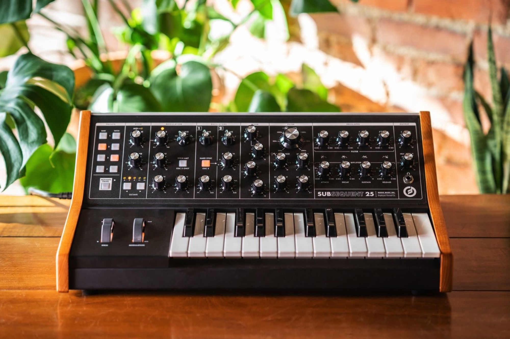

## Moog Synthesizer

- Created by Robert Moog
- Work started in 1963 after meeting Herb Deutsch
- Innovated in its use of transistors instead of vacuum tubes
- $16,000 grant

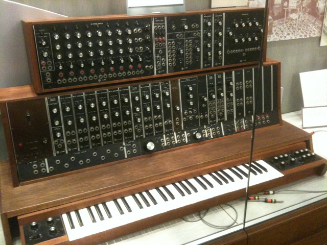

> According to Moog, when Deutsch saw this, he became excited and immediately
> began making music with the prototype, attracting the interest of passersby:
> "They would stand there, they'd listen and they'd shake their heads ... What
> is this weird shit coming out of the basement?"

- Presented at the annual Audio Engineering Society convention in 1964
- People bought his synth then and there, even though he didn't plan to sell it
- Built to order, no instruction books or guides

## Problems

- **Very** expensive
- Analog synths are specialized hardware
- Digital synths are subscriptions and proprietary software
- Choice overload

# Digital Audio Workstations

- One stop shop
- Common ones are:
    - Reaper
    - FL Studio
    - Ableton

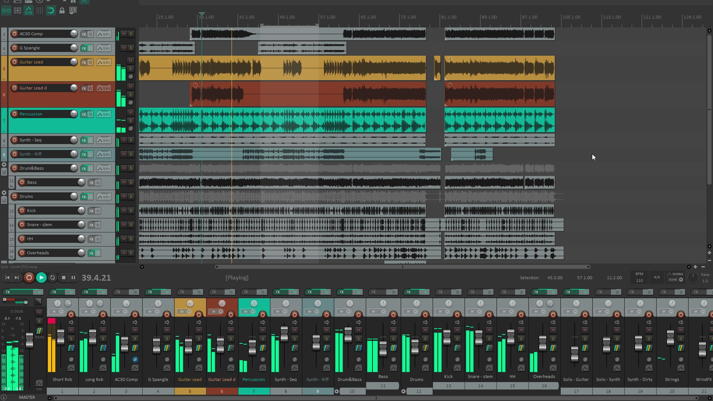

### Virtual Studio Technology

- FOSS plugin system for DAWs
- Hundreds of thousands free and paid VSTs are available

# Synth Modules

- Many, many different types
- Control, modification, generation

### Eurorack

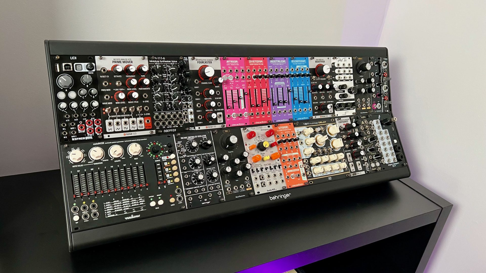

- Based on the Eurocard standard
    - IEEE
    - Standard PCB sizes that can all fit into the same cases
- Uses U for height units and HP for width units
- +/-12V power

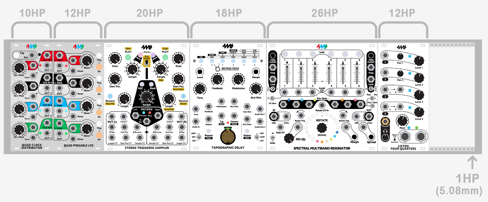

## Voltage Controlled Oscillators

- Create the base waveform that your human ears can hear
- Inputs control the pitch of the sounds, not the volume
- Most oscillator modules will have multiple VCOs

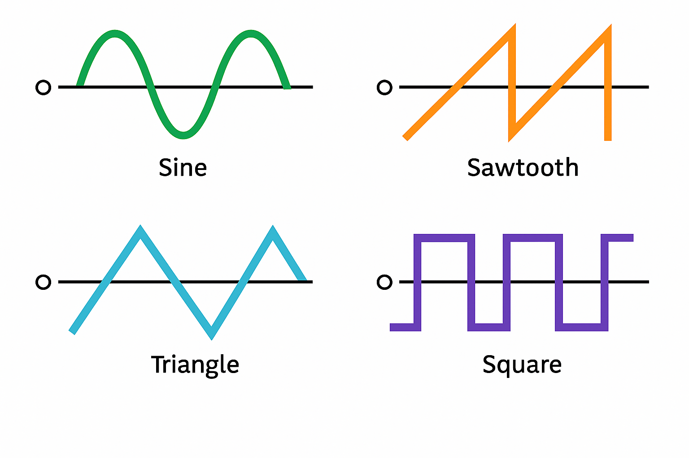

## Voltage Controlled Filters

- The most basic way to modify sounds
- Typically, VCOs connect directly to VCFs

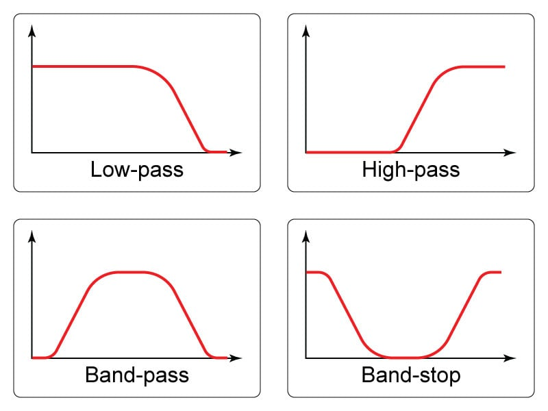

- `<INSERT FOURIER TRANSFORM TANGENT HERE>`

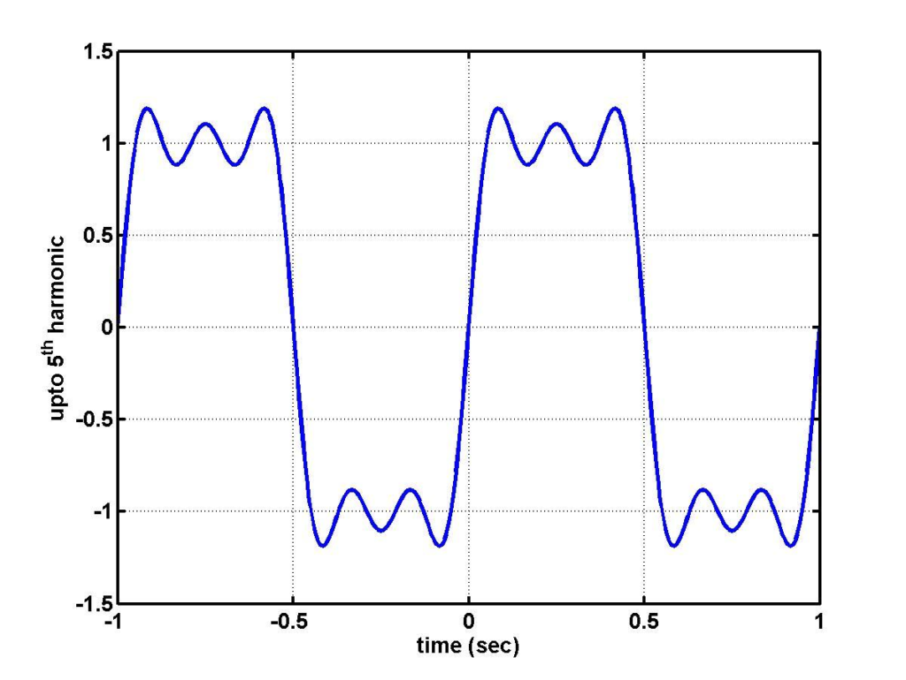

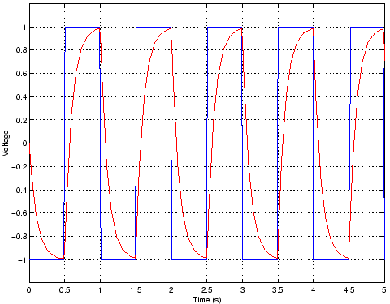

- Filtering a sine wave is useless (or, technically it is volume control!)

## Voltage Controlled Amplifiers

- *Actual* volume control
- The only way to turn a VCO "off"

## Low Frequency Oscillators

- VCOs that produce sounds below the human range of hearing
- Used as control signals for other modules
- Vibratto, tremelo

### Frequency Modulation

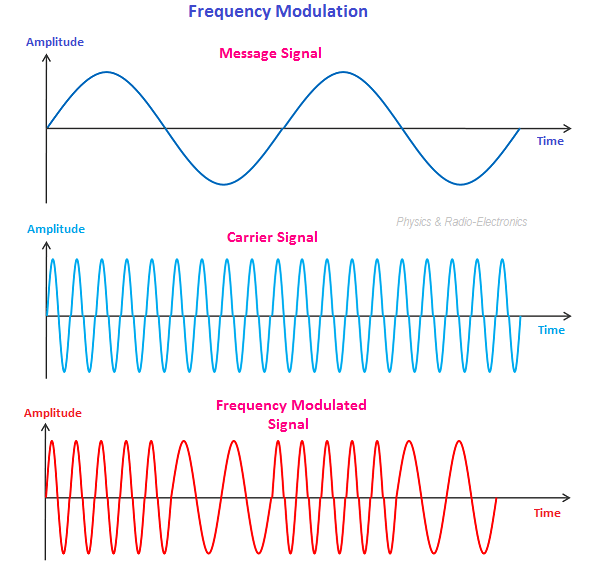

## Envelope Generators

- Unlike everything else mentioned here, these only "fire off" when a key is
  pressed
- Four properties
    - **Attack**
    - **Delay**
    - **Sustain**
    - **Release**

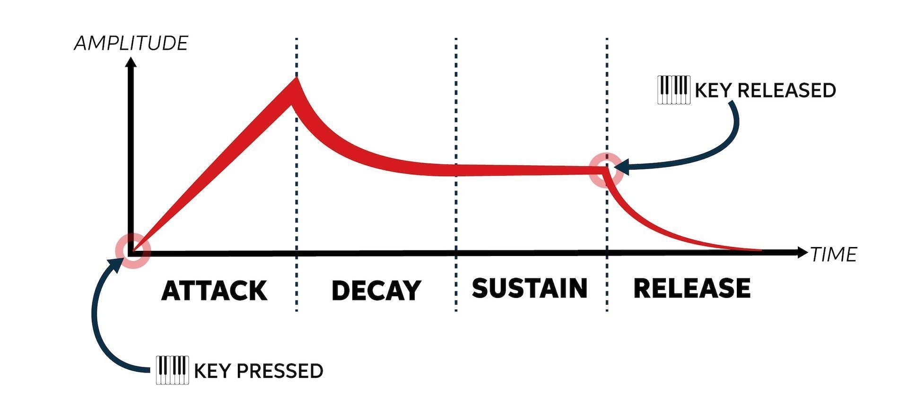

## Ring Modulators

- Like FM but for the amplitude instead of the frequency

## And More!

- Noise circuits create random noise (white, brown, blue, pink)
- Mixers combine multiple waves into one
- Splitters duplicate one wave into multiple
- Sequencers create repeating patterns

# My Synth

### Core Module

- A Raspberry Pi Pico with extra outputs duct-taped on.
- Control Signals and Power Supply
- Creates the CV using an I2C-controlled Digital-to-Analog Converter

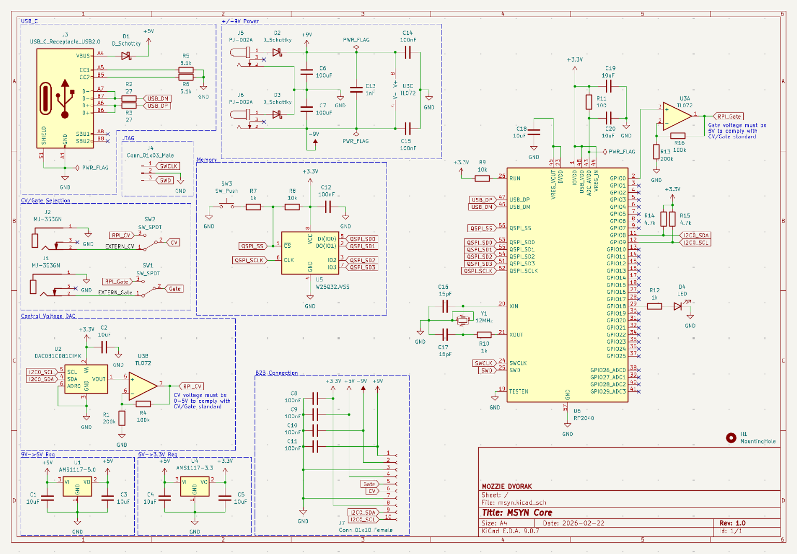

### Oscillator Module

- One VCO, one LFO

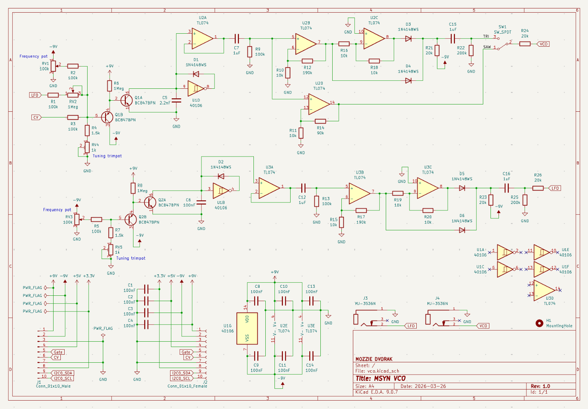

### Filter Module

- Straight ripoff of the Polivoks filter

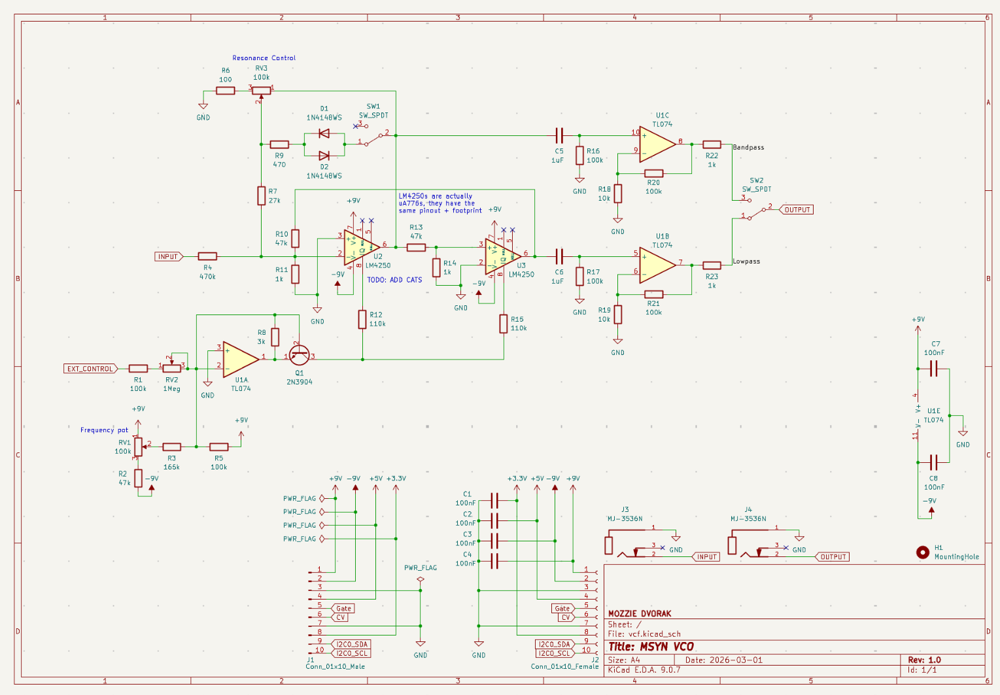

### Amp Module

- VCA and ADSR ENV

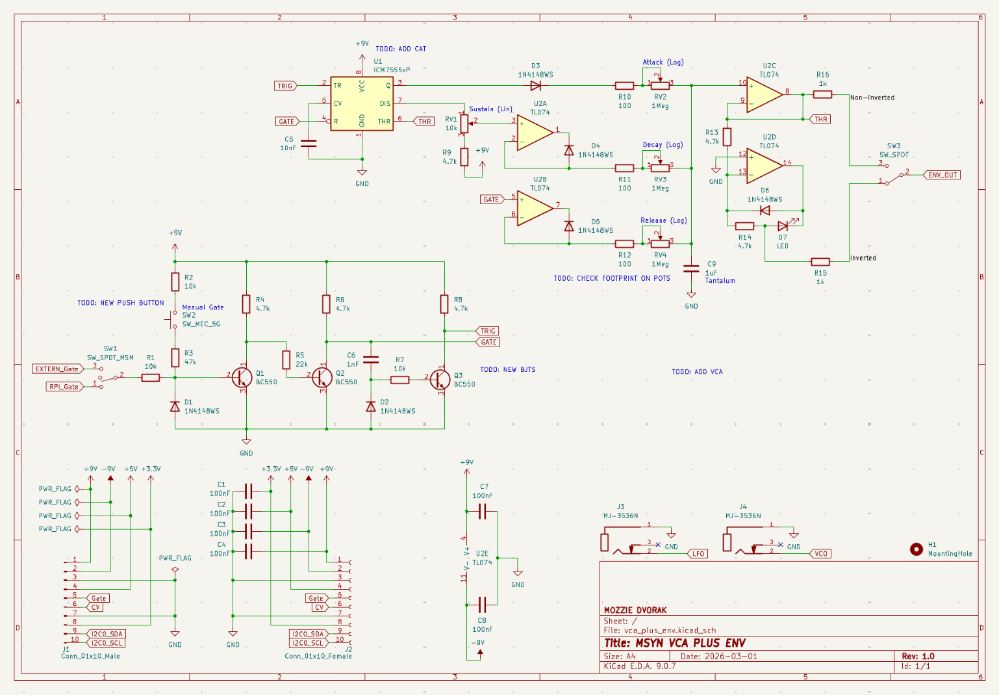

## Assembled!

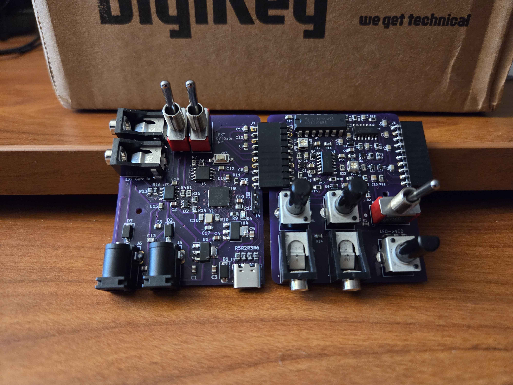

# Software

### DAWs

- Reaper <https://reaper.fm>
- FL Studio <https://image-line.com/fl-studio>

### Plugins

- Synth1 <https://daichilab.sakura.ne.jp/softsynth>

### Misc.

- SunVox <https://warmplace.ru/soft/sunvox/>
